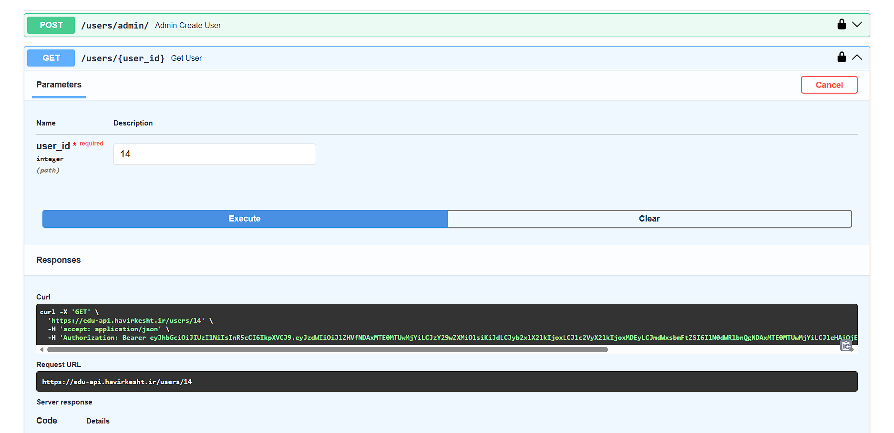
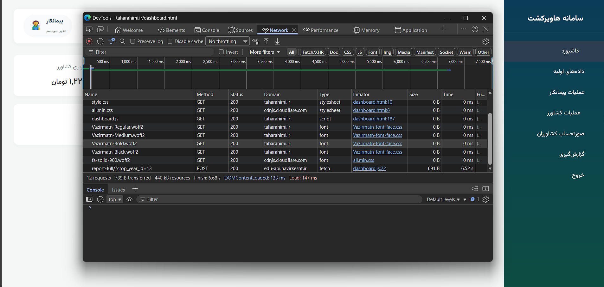
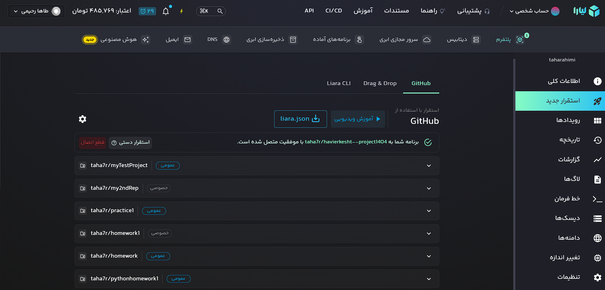

# havierkesht--project1404
# پروژه پایانی درس برنامه‌نویسی وب - سامانه هاویرکشت 🌾
[cite_start]**دانشگاه لرستان - نیمسال اول ۱۴۰۴** **استاد:** دکتر آرمین رشنو [cite: 6]  
**دانشجو:** [طاها رحیمی]

## 🎯 اهداف پروژه
[cite_start]این سامانه با هدف رصد و پایش محصولات و صورتحساب‌های مالی کشاورزان چغندرقند طراحی شده است[cite: 25, 26]. 
[cite_start]قابلیت‌های کلیدی بررسی شده در این پروژه شامل مدیریت وزن بار، عیار، درصد افت و سهمیه قند و تفاله است[cite: 26].
## 📑 مرحله ۱ و ۲: مستندسازی و تحلیل APIها
[cite_start]لیست APIهای کلیدی که از محیط Swagger استخراج و تست شده‌اند[cite: 33, 34]:

| متد | مسیر (Endpoint) | توضیح |
| :--- | :--- | :--- |
| `POST` | `/users/admin/` | [cite_start]ایجاد کاربر جدید با نقش ادمین [cite: 57, 58] |
| `GET` | `/seed/` | [cite_start]بازیابی لیست دانه‌ها با قابلیت فیلتر [cite: 67, 68] |
| `PUT` | `/farmer/{id}` | [cite_start]به‌روزرسانی اطلاعات کشاورزان [cite: 128] |
| `DELETE` | `/product-price/{id}` | [cite_start]حذف قیمت محصول [cite: 133] |

**اتصال صفحات به API:**
- [cite_start]**صفحه لاگین:** متصل به `GET /users/{id}` جهت احراز هویت[cite: 142, 143].
- [cite_start]**صفحه ثبت سم:** متصل به `GET /pesticide/` و `GET /factory/`[cite: 150, 151].

## 🛠 مرحله ۶ تا ۹: زیرساخت و استقرار خودکار
در این پروژه از زیرساخت‌های ابری برای میزبانی استفاده شده است:

* [cite_start]**میزبانی (Hosting):** استفاده از پلتفرم ابری **لیارا** (Liara)[cite: 42].
* [cite_start]**مدیریت نسخه:** استفاده از **GitHub** برای Push کردن سورس‌کد[cite: 46].
* **CI/CD:** پیاده‌سازی فرآیند استقرار خودکار؛ [cite_start]به طوری که با هر `git push` تغییرات بلافاصله روی سرور اعمال می‌شود[cite: 50].

